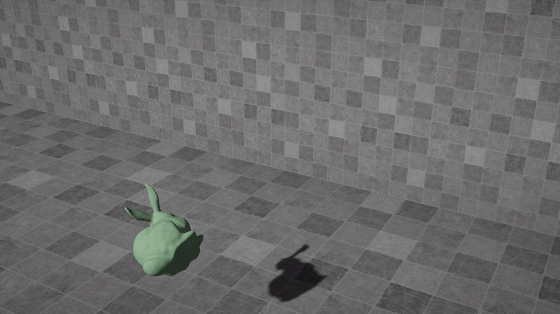

# GAMES103
HWs for GAMES103: Physics-Based Animation.

## Lab 1 - Angry Bunny (Rigidbody)

### Method 1. Impulse Method, Leapfrog Integration

### Method 2. Shape Matching

## Lab 2 - Cloth Simulation 

### Method 1. Mass-spring Implicit Integration
#### CPU Implementation

#### GPU Parallelized Implementation (with Compute Shader)

### Method 2. Position Based Dynamics

## Lab 3 - Bouncy House (Elasticbody Explicit FVM)

### Method 1. FVM with Green Strain

Slowed down, with Laplacian Smoothing:

Fail with large deformation:

### Method 2. FVM with Principal Invariants of Deformation Gradient (using SVD)
#### CPU Implementation

Slowed down, without Laplacian Smoothing:

#### GPU Parallelized Implementation (with CUDA<small>®</small>)
##### StVK Model

Without laplacian smoothing:

With laplacian smoothing:

Becomes plastic with large deformation:

##### neo-Hookean Model

Without laplacian smoothing:

With laplacian smoothing:

### Extra: Implicit Solver

Implemented according to [[Xu et al. 2018]](https://doi.org/10.1145/2766917).

Several detail issues remain to be solved...

## Lab 4 - Pool Ripples (Shallow Wave)

### Water Drop

### Two-way Coupling with Rigidbodies

